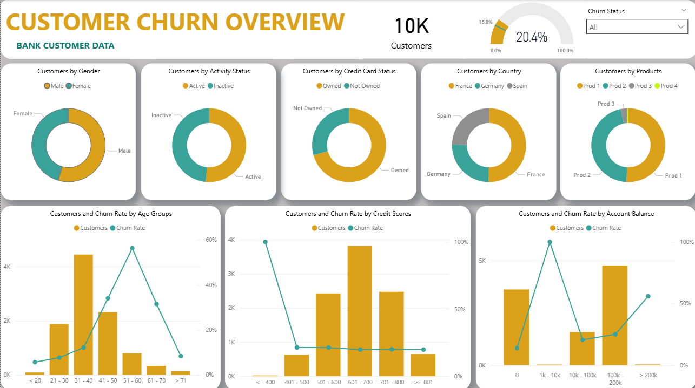
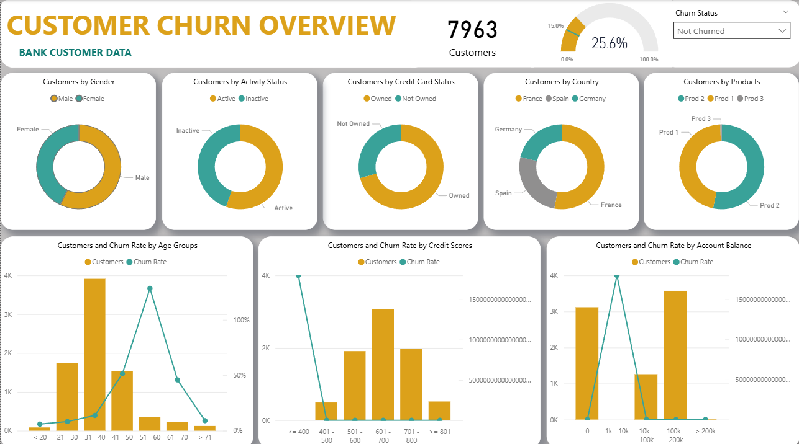
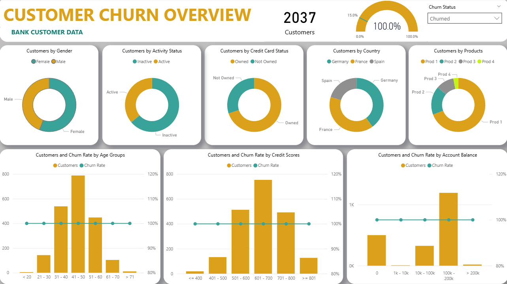

# 📊 Bank Customer Churn Analysis – Power BI

## About The Project

Customer churn is a major concern in the banking industry, as losing customers directly affects revenue and long-term growth. In this project, I built an interactive Power BI dashboard to analyze churn patterns using a dataset of 10,000 customers.

Out of these, 2,037 customers had exited the bank, resulting in an overall churn rate of approximately 20%. The goal of this dashboard was to understand why customers leave and identify which segments are more likely to churn.

---

## What This Dashboard Covers

The dashboard provides a complete overview of:

* Total customer count and churn rate
* Customer distribution by gender and country
* Credit card ownership and activity status
* Product-wise segmentation
* Churn rate by age group
* Churn rate by credit score
* Churn rate by account balance range

I also added a slicer to dynamically compare:

* All customers
* Only churned customers
* Only retained customers

This makes the report interactive and helps analyze behavioral differences clearly.

---

## Dashboard Screens

### Overall Dashboard



---

### Not Churned Customers



---

### Churned Customers



---

## How I Calculated Churn Rate (DAX Logic)

To calculate churn properly, I created three DAX measures.

First, I calculated the total number of customers:

```DAX
Customers =
COUNTROWS('Bank Customer Data')
```

Then, I calculated how many customers had churned using a filter condition:

```DAX
Customer Lost =
CALCULATE(
    COUNTROWS('Bank Customer Data'),
    'Bank Customer Data'[Churn Status] = "Churned"
)
```

Finally, I calculated the churn rate:

```DAX
Churn Rate =
DIVIDE(
    [Customer Lost],
    [Customers],
    0
)
```

I used the `DIVIDE()` function instead of direct division because it safely handles cases where the denominator could be zero.

---

## Key Insights from the Analysis

From the dashboard, I observed:

* Customers aged 41–60 show comparatively higher churn.
* Inactive customers are significantly more likely to leave.
* Lower credit score customers have higher churn probability.
* Product ownership patterns influence churn behavior.
* There are slight variations in churn distribution across countries.

These insights suggest that banks can focus on targeted retention strategies rather than applying general policies to all customers.

---

## Tools Used

* Microsoft Power BI
* Power Query for data cleaning
* DAX for measure creation
* Data modeling and relationships

---

## What I Gained from This Project

This project helped me strengthen:

* Practical understanding of DAX functions like `CALCULATE` and `DIVIDE`
* KPI design aligned with business objectives
* Data storytelling through visualization
* Analytical thinking in churn prediction scenarios

---

### AUTHOR
OVIYA MAHESWARI.N
